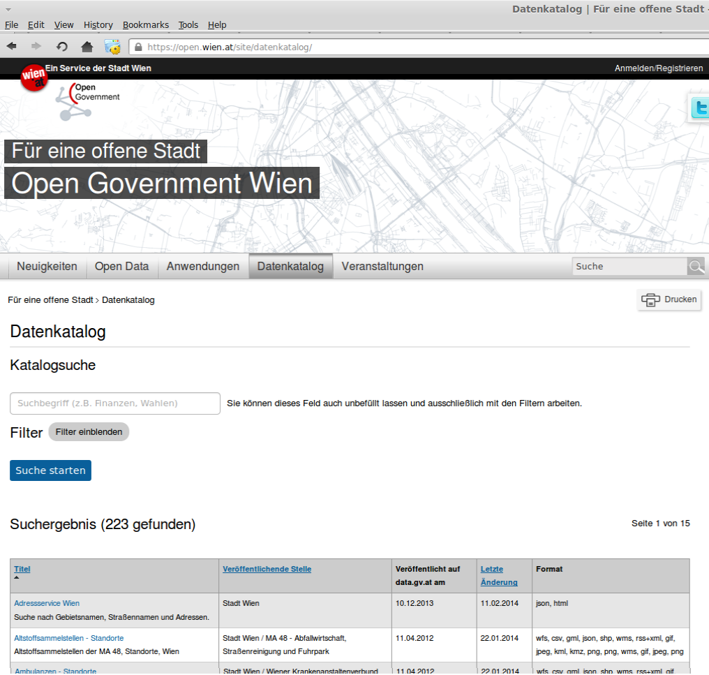

# 1. Grundlagen

Das folgende Dokument beinhaltet eine Einführung in 
- 1) die Graphentheorie und deren Anwendungsmöglichkeiten in der Mobilitätsforschung, 
- 2) den Prinzipien von offener Wissenschaft mit Open Source Software, Open Data Repositories für die Daten und offene Datenformate für den Austausch räumlicher Inforamtionen und Graphen und 
- 3) Lösungsansätze bei Problemen und Fragen.

Weitere Materialien und Informationen erfährt ihr auf der [Übersichts-Seite](http://openscienceasap.org/education/courses/vu-einfuehrung-geo-netzwerkanalyse/).

## Graphentheorie

Die theoretische Grundlage für Netzwerke ist die Graphentheorie und beschäftigt sich mit der Erforschung von Netzwerk-Strukturen (Easley & Kleinberg 2010, S. 23). Nach Definition spezifiziert ein Graph Beziehungen zwischen verschiedenen Elementen. Er besteht aus einer Sammlung von Objekten, Knoten genannt, mit bestimmten Paaren dieser Objekte verbunden durch Links, genannt Kanten (Easley & Kleinberg 2010, S. 23).  Wegen diesem flexiblen Formalismus ist es einfach Netzwerke in den verschiedensten Domainen in der echten Welt zu finden, wie Sozialwissenschaften, Mikro-Biology, Psychology oder Elektrotechnik.

Die verwendeten Begriffe für diese beiden Elemente sind meist je nach Disziplin unterschiedlich (Latapy & Magnien 2008):
- Mathematik: Vertizes und Kanten
- Physik: Sites und Bonds
- Soziologie: Akteure und Verbindungen
- Computer Sciences: Knoten und Links

BILD
grundkonzept graph

Die Netzwerktheorie beschäftigt sich mit großen Netzwerken, die mit dem Aufkommen von Informations- und Kommunikationstechnologien (ICT/IKT) immer mehr an Relevanz bekommen. Der mathematische Unterbau dazu ist die Graphentheorie. !ZITAT!

BILD
großer Graph

Eulers **[Königsberger-Brückenproblem](https://de.wikipedia.org/wiki/K%C3%B6nigsberger_Br%C3%BCckenproblem)** ist ein bekanntes Problem der Graphentheorie. Dieses  besteht darin, wie jede Kante (im Beispiel 7 Brücken) nur einmal passiert werden muss, um am Ende wieder zum Ausgangspunkt zu gelangen. Daraus lassen sich zwei weitere Begriffe ableiten.

* *Eulerkreis*: In einem zusammenhängenden Graphen existiert genau dann ein Eulerkreis, wenn alle Knoten geraden Grad besitzen.

* *Eulerweg*: In einem zusammenhängenden Graphen existiert genau dann ein Eulerweg, wenn zwei Knoten einen ungeraden Grad haben

### Arten von Graphen
Es gibt verschiedene Unterscheidungsmerkmale für Graphen/Netzwerke, abhängig von deren Struktur und Eigennschaften.

**Directed/Undirected:** 
Kanten können eine Richtung haben (directed) oder auch keine (undirected), wodurch die Beziehung in beide Richtungen gleich ist, also symmetrisch. Typische ungerichtete Netzwerke sind Links auf Websites. Freundschaften sind zumeist symmetrisch. Um die Richtung zu signalisieren, sind gerichtete Kanten durch einen Pfeil dargestellt.

*Gerichteter Graph (links), ungerichteter Graph (rechts)*

**Gewichtet/Ungewichtet:**
Die Kanten können auch eine Gewichtung haben, also das Verhältnis kann quantitativ bemessen werden. Wie oft haben sich zwei Menschen getroffen oder wie groß ist die Bandbreite einer Datenverbindung. Um so höher die Zahl, desto höher ist die Gewichtung des Verhältnisses.

BILD

**Multimodale Graphen:**
Es können zwischen einem Paar von Knoten auch mehrere verschiedene Kanten bestehen. Ein Netzwerk mit diesen Eigenschaften wird multimodal genannt und ist insbesondere in der Mobilitätsforschung (in Form von unterschiedlichen Verkehrsmitteln) weit verbreitet.

**Bipartite:**
Eher wenig Bedeutung in der Geographie.

Bipartite Graphen sind eine spezielle Klasse von Netzwerken, bei denen die Kanten in zwei Mengen (X und Y) unterteilt sind und wo nur Verbindungen zwischen zwei Knoten aus verschiedenen Sets bestehen (Easley & Kleinberg). Die Kanten können gerichtet/ungerichtet oder gewichtet/ungewichtet sein.

BILD
konzept bipartite

Bipartite Netzwerke haben in der Mobilitätsforschung kaum Verwendung.

**3D**

  
### Shortest Path

Shortest Path bezeichnet Algorithmen, die die kürzeste Verbindung zwischen zwei Knoten sucht und somit die zentrale Aufgabe zum Lösen eines Routing-Problems ist. Es gibt verschieden Arten (Algorithmen) solche Shortest Path Probleme zu lösen. Ein sehr weit verbreiteter ist der Dijkstra Algorithmus ([Video](https://www.youtube.com/watch?v=Q5ebFH8Yho4)). Weitere Algorithmen sind [A*](http://de.wikipedia.org/wiki/A*-Algorithmus), [Bellman-Ford](http://de.wikipedia.org/wiki/Bellman-Ford-Algorithmus) oder [Floyd Warshall](http://de.wikipedia.org/wiki/Algorithmus_von_Floyd_und_Warshall)

### Centralities
#### Degree (Grad)
Der Grad eines Knoten ist die Anzahl an Kanten, die von ihm ausgehen. Bei einem gerichteten Graphen gibt es noch die Unterscheidung in Indegree, Zahl der Kanten zum Knoten, und Outdegree, Zahl der Kanten weg vom Knoten.

#### Betweeness
Betweeness Centrality stellt den relativen Anteil aller Shortest Path die über einen Knoten laufen dar.

#### Closeness

### Community Detection

Communities sind Gruppen von Knoten, die möglicherweise gemeinsame Eigenschaften besitzen und/oder ähnliche Rollen innerhalb des Graphens inne haben (Fortunato 2010).

Eine verbundene Komponente eines Graphen ist eine Untermenge der Knoten, wo es 1) von jedem Knoten einen Pfad zu jedem anderen Knoten gibt; und 2) die Untermenge nicht teil einer größeren Sammlung mit der Eigenschaft, dass jeder Knoten jeden anderen erreichen kann, ist (Easley & Kleinberg 2010, S. 29). Große, komplexe Netzwerke haben oft einen sogenannten Giant Component, ein beabsichtigt formaler Begriff für eine verbundene Komponente, die einen signifikanten Anteil aller Knoten enthält (Easley & Kleinberg 2010, S. 31).

## Anwendungen 

### Verkehr
**Evaluatoren:** werden verwendet, um Attribute der Quelldaten den Netzwerkelementen zuzuweisen (z.B. verschiedene Angaben zu Kreuzungen (Wartezeit) werden aus einem jeweiligen Shape hinzugefügt; ebenso falls es unterschiedliche Einschränkungen gibt; auch Fahrzeit)

#### Analysen
**Der Einzugsbereich (Service Area)** ist eine Zone um einen Knoten, der auf Basis von Kosten und Impedanzen berechnet wird. Alle Punkte innerhalb dieser Zone können den zentralen Knoten in dem gegebenen Zeitintervall erreichen. Es können über mehrere Zeitintervalle mehrere Zonen gezogen werden. Die Visualisierung von Einzugsbereichs zeigt beispielsweise, welche Gebiete einer Stadt gut erreichbar sind und welche nicht. Dazu gehören Erreichbarkeiten und Reichweiten.

**Closest Facility** ist eine Analyse, die von einem gegebenen Startpunkt den nächsten von mehreren gegebenen Endpunkten sucht. Als Startpunkt kann z.B. ein Unfallort dienen, die Endpunkte sind Krankenhäuser, gesucht wird das nächste Krankenhaus. Bei der Analyse können Impedanzen festgelegt und die besten Routen, Fahrkosten und Wegbeschreibungen mit z.B. Shortest Path ermittelt werden.

**Vehicle Routing Problem** Unter Vehicle Routing Problem versteht man das Problem, eine möglichst gute Zuordnung von Fahrzeugen zu Aufträgen und für jedes Fahrzeug eine optimale Reihenfolge der zu bedienenden Auftragsstandorte zu finden. Eine Lösung eines Tourenplanungsproblems hat daher meist zwei Aspekte: die Clusterung gibt an, welche Aufträge zu einer Tour zusammengefasst werden, und das Routing definiert, in welcher Reihenfolge die Punkte innerhalb einer Tour bedient werden. Zielsetzung einer Tourenplanung ist zum Beispiel die Minimierung der Anzahl der eingesetzten Fahrzeuge, der zurückgelegten Strecke, der Einsatzzeit oder einer komplexeren Kostenfunktion. Beim Standardproblem der Tourenplanung liegen alle Start- oder Zielpunkte in einem Depot und es stehen dort eine begrenzte oder unbegrenzte Zahl von Fahrzeugen zur Verfügung. Andere Varianten betrachten zusätzliche Kapazitätsrestriktionen für die Fahrzeuge (Capacited Vehicle Routing Problem, CVRP), mehrere Depots oder beliebige Start- und Zielpunkte (sog. Pickup-and-Delivery-Probleme).

ZITAT https://en.wikipedia.org/wiki/Vehicle_routing_problem

### Weitere

=> Verweis, Grundlegendes (Wikipedia)

Beispiele nennen, Bilder zeigen, Grundsätzliches Verständnis, kurze Beschreibung

Co-Citation, Biblometric Coupling, 

BILD

https://de.wikipedia.org/wiki/Soziale_Netzwerkanalyse
Internet

BILD

Elektrizitätsnetz

Wasserversorgung

BILD

Krankheiten

BILD

Neuronale Netze

BILD

## Offenheit

Das gesamte Repository ist nach den Prinzipien von [Open Science](http://openscienceasap.org/open-science/) erstellt.

BILD
Open Science

Somit sind alle Inhalte, sofern nicht anders angegeben, nach den Vorgaben der [Open Definition](http://opendefinition.org/) lizenziert. Texte und Bilder sind unter der [Creative Commons BY](https://creativecommons.org/licenses/by/3.0/at/) lizenziert. 

### Open Source Software

Es wurde nur [Open Source Software](https://de.wikipedia.org/wiki/Open_Source) verwendet und der selbst erstellte Quellcode ist unter der [MIT Lizenz](http://opensource.org/licenses/MIT) freigegeben. 

Folgend nähere Infos zur Software.

#### QGIS
[QGIS](http://www.qgis.org/) ist ein benutzerfreundliches Geoinformationssystem zum Betrachten, Bearbeiten und Erfassen von räumlichen Daten und ist mit der GNU General Public License lizenziert. Wesentliche Merkmale der Applikation sind die breite Unterstützung gängiger Vektordaten und Rasterdaten wie Shapefile oder GeoTIFF, aber auch räumlicher Datenbanken wie PostGIS und SpatiaLite, ausgereifte Digitalisier-Werkzeuge zum Erfassen von Vektordaten sowie eine Druckzusammenstellung zum einfachen Erstellen von Kartenausdrucken.

Die QGIS-Architektur baut stark auf Erweiterungen auf. Nennenswert sind die fTools-Werkzeuge für allgemeine vektorbasierte Aufgaben oder die GRASS-Erweiterung für anspruchsvolle räumliche Analysen. Eine GPS-Erweiterung erlaubt es, GPX-Dateien zu lesen oder direkt auf ein GPS-Gerät zuzugreifen. Andere Erweiterungen erlauben das Einbinden von WMS- und WFS-Diensten.
ZITAT http://de.wikipedia.org/wiki/QGIS

**Benötigte Plugins**
- DB Manager
- fTools
- GRASS

**Starten mit QGIS** 

Informationen zum Runterladen und Installieren findet man auf [qgis.org](http://qgis.org/). 

Erste Schritte mit QGIS befinden sich unter ['Dokumenation' auf qgis.org](http://www.qgis.org/de/docs/index.html#documentation-for-qgis-2-0). Besonders zu empfehlen sind die beiden Screencast Serien [Tutorial von MrHiddin1](http://www.youtube.com/playlist?list=PLedvCUusOD_nxprzIwuDSA5oH61vUCP_w) und [Tutorial von jarretttotton](http://www.youtube.com/playlist?list=PLedvCUusOD_khPbVeSouD3jYcAv-0GUkU) zu Beginn, welche einen schnellen und umfassenden Überblick in QGIS geben.

#### GRASS GIS

[GRASS GIS](http://grass.osgeo.org/) ist eine hybride, modular aufgebaute Geoinformationssystem-Software mit raster- und vektororientierten Funktionen. GRASS steht für Geographic Resources Analysis Support System, GIS für Geographical Information System.

Es steht unter der GNU General Public License und ist damit eine frei verfügbare Software. Das System bietet Raster- und topologische Vektordatenfunktionalität, 3D-Raster-Voxelbearbeitung, Bildverarbeitung, Visualisierungsmöglichkeiten und den Im- und Export verschiedener GIS-Datenformate. Als portable Software läuft es auf verschiedenen Betriebssystemen mit einer graphischen Benutzeroberfläche sowie optional per Kommandozeile.
ZITAT http://de.wikipedia.org/wiki/GRASS_GIS

**Starten mit GRASS GIS**

Informationen zum Runterladen und Installieren sowie Tutorials und die Dokumentation gibt es auf [grass.osgeo.org](http://grass.osgeo.org/).

Um einen Überblick zur zu Beginn doch meist gewöhnungsbedürtigen Oberfläche und Datenverwaltung zu bekommen empfiehlt sich der [Workshop von Markus Neteler](http://geostat-course.org/Topic_NetelerMetz_2011) ([Videos](https://archive.org/details/GeostatSummerSchoolGrassGisTutorial)).

#### Git und GitHub

**[Git](http://git-scm.com/)** ist eine freie Software zur verteilten Versionsverwaltung von Dateien, die ursprünglich für die Quellcode-Verwaltung des Linux-Kernels entwickelt wurde. Git ist ein verteiltes Versionsverwaltungssystem, das sich in einigen Eigenschaften von traditionellen Versionskontrollsystemen unterscheidet:
- Nicht-lineare Entwicklung: Sowohl das Erstellen neuer Entwicklungszweige (branching) als auch das Verschmelzen zweier oder mehrerer Zweige (merging) sind integraler Bestandteil der Arbeit mit Git, fest in die Git-Werkzeuge eingebaut und sehr performant.
- Kein zentraler Server: Jeder Benutzer besitzt eine lokale Kopie des gesamten Repositorys, inklusive der Versionsgeschichte (history). So können die meisten Aktionen lokal und ohne Netzwerkzugriff ausgeführt werden.
- Datentransfer zwischen Repositories: Daten können mit einer Reihe verschiedener Netzwerkprotokolle zwischen Repositories übertragen werden.
- Kryptographische Sicherheit der Projektgeschichte: Die Geschichte eines Projektes wird so gespeichert, dass der Hash einer beliebigen Revision (commit) auf der vollständigen Geschichte basiert, die zu dieser Revision geführt hat.
- Speichersystem und Dateiversionierung: Im Gegensatz zu CVS, wo jede Datei eine eigene Revisionsnummer besitzt, speichert Git bei einem Commit das gesamte Dateisystem ab.
- Säubern des Repositories: Die Daten gelöschter und zurückgenommener Aktionen und Entwicklungszweige bleiben vorhanden (und können wiederhergestellt werden), bis sie explizit gelöscht werden.
- Interoperabilität: Es gibt Hilfsprogramme, die Interoperabilität zwischen Git und anderen Versionskontrollsystemen herstellen.
- Web-Interface

**[GitHub](https://github.com/)** ist ein webbasierter Hosting-Dienst für Software-Entwicklungsprojekte. Namensgebend ist das Versionsverwaltungs-System Git. 

Im Gegensatz zu anderen Open-Source-Hostern wie SourceForge ist auf GitHub nicht das Projekt als Sammlung von Quellcode zentral, sondern der Nutzer mit seinen Repositories (Verzeichnissen, die von Git kontrolliert werden). Gleichzeitig wird das Erstellen und Wiedervereinigen von Abspaltungen (Forks) besonders propagiert. Forks dienen weiterhin dazu, einfach bei anderen Projekten mitentwickeln zu können. Um einem Repository/Projekt einen Beitrag beizusteuern, wird das Repository zunächst aufgespalten, dann werden die zu übernehmenden Änderungen hinzugefügt und dem Besitzer des Ur-Repositorys ein Pull-Request gestellt (alles über die Weboberfläche). Damit soll den Besonderheiten verteilter Versionskontrollsysteme besonders Rechnung getragen und zugleich ein soziales Netzwerk geschaffen werden, was sich auch in dem Slogan des Unternehmens und den aus „echten“ sozialen Netzwerken bekannten Funktionen „Beobachten“ oder „Folgen“ niederschlägt.

Während Open-Source-Projekte GitHub kostenfrei nutzen können, gibt es auch kostenpflichtige Angebote für proprietäre Software, die zum Beispiel erlauben, sogenannte Private Repositorys zu erstellen, die nicht öffentlich einsehbar sind. Kostenfreie Accounts dürfen nur öffentliche Repositorys erstellen. 
ZITAT http://de.wikipedia.org/wiki/GitHub

**Starten mit Git/GitHub**

Zu Beginn sollte man sich in die Verwendung von Git zum Versionieren einlesen und -üben. Hier empfiehlt sich das Buch [Pro Git von Scott Chacon](http://git-scm.com/book) sowie das Durchgehen der [Dokumentation](http://git-scm.com/doc).

Um Versionierung mit Git und GitHub interaktiv zu lernen, bietet sich der [Online-Workshop tryGit](http://try.github.io//levels/1/challenges/1). Am besten ist es aber wie so oft, lokal am eigenen Rechner zu üben und herum zu spielen (Backup davor nicht vergessen!).

#### spatialSQL: postgresql, postGIS, pgRouting und pgAdmin3

Zum Arbeiten mit räumlichen Daten wird eine Geodatenbank aufgesetzt. Hierzu wird postgresql als Datenbankmanagementsystem verwendet, welches mittels den Erweiterungen postGIS mit räumlichen Funktionen und pgRouting mit Routing-Funktionen für Mobilitätsforschung vorbereitet ist.

**[postgreSQL](http://www.postgresql.org/)** ist ein freies, objektrelationales Datenbankmanagementsystem (ORDBMS). Seine Entwicklung begann in den 1980er Jahren, seit 1997 wird die Software von einer Open-Source-Community weiterentwickelt.

PostgreSQL ist weitgehend konform mit dem SQL-Standard ANSI-SQL 2008,[4] d. h. der Großteil der Funktionen ist verfügbar und verhält sich wie definiert. PostgreSQL ist vollständig ACID-konform (inklusive der Data Definition Language), und unterstützt erweiterbare Datentypen, Operatoren, Funktionen und Aggregate[5]. Obwohl sich die Entwicklergemeinde sehr eng an den SQL-Standard hält, gibt es dennoch eine Reihe von PostgreSQL-spezifischen Funktionalitäten, wobei in der Dokumentation bei jeder Eigenschaft ein Hinweis erfolgt, ob dies dem SQL-Standard entspricht, oder ob es sich um eine spezifische Erweiterung handelt. Darüber hinaus verfügt PostgreSQL über ein umfangreiches Angebot an Erweiterungen durch Dritthersteller, wie z. B. PostGIS.
ZITAT http://de.wikipedia.org/wiki/PostgreSQL

**[SQL](http://de.wikipedia.org/wiki/SQL)** ist eine Datenbanksprache zur Definition von Datenstrukturen in relationalen Datenbanken sowie zum Bearbeiten (Einfügen, Verändern, Löschen) und Abfragen von darauf basierenden Datenbeständen.

Die Sprache basiert auf der relationalen Algebra, ihre Syntax ist relativ einfach aufgebaut und semantisch an die englische Umgangssprache angelehnt. Fast alle gängigen Datenbanksysteme unterstützen SQL – allerdings in unterschiedlichem Umfang und leicht voneinander abweichenden „Dialekten“. Durch den Einsatz von SQL strebt man die Unabhängigkeit der Anwendungen vom eingesetzten Datenbankmanagementsystem an.

Die Bezeichnung SQL wird im allgemeinen Sprachgebrauch als Abkürzung für „Structured Query Language“ aufgefasst, obwohl sie laut Standard ein eigenständiger Name ist. 
ZITAT http://de.wikipedia.org/wiki/SQL

**[postGIS](http://postgis.org/)** ist eine Erweiterung für die objektrelationale Datenbank PostgreSQL, die geografische Objekte und Funktionen umfasst. PostgreSQL mit PostGIS bildet eine Geodatenbank, die in Geoinformationssysteme eingebunden werden kann. Das Projekt implementiert die 'Simple Feature Access-Spezifikation' des [Open Geospatial Consortium](http://de.wikipedia.org/wiki/Open_Geospatial_Consortium) und wird von der [Open Source Geospatial Foundation](http://de.wikipedia.org/wiki/Open_Source_Geospatial_Foundation) betreut.
ZITAT http://de.wikipedia.org/wiki/PostGIS

**[pgRouting](http://pgrouting.org/)** erweitert die PostgreSQL und postGIS um eine räumliche Routing-Funktionalität, steht unter der GPLv2 Lizenz. So können Daten durch verschiedene Clients verändert werden und sind sofort anwendbar. Kosten können dynamisch via SQL berechnet werden.
ZITAT http://pgrouting.org/

**[pgAdmin](http://www.pgadmin.org/)** ist eine Open-Source-Software zur Entwicklung und Administration von PostgreSQL-Datenbanken. Eine graphische Benutzeroberfläche erleichtert die Administration von Datenbanken. Der Editor für SQL-Abfragen enthält ein graphisches EXPLAIN, mit dessen Hilfe sich performantere Abfragen erstellen lassen. Durch eine native Anbindung an PostgreSQL ermöglicht das GUI den Zugriff auf die gesamte PostgreSQL-Funktionalität.
ZITAT http://de.wikipedia.org/wiki/PgAdmin

**Starten mit postgreSQL, postGIS und pgRouting**

Das Installieren von postgreSQL mitsamt den beiden Erweiterungen kann je nach Betriebssystem etwas komplizierter sein. Mit der aktuellen Ubuntu Version 13.10  sollte es aber relativ einfach und schnell gehen ([Install/Setup in Ubuntu 13.10](http://trac.osgeo.org/postgis/wiki/UsersWikiPostGIS21UbuntuPGSQL93Apt)). pgRouting muss kompiliert werden, was je nach Betriebssystem unterschiedlich funktioniert.

Um postgreSQL verwenden zu können, muss man die Abfragesprache [SQL](http://de.wikipedia.org/wiki/SQL) beherrschen. Erste Schritte können mittels [W3CSchool](http://www.w3schools.com/sql/) oder [Youtube Tutorials](http://www.youtube.com/results?search_query=learn%20sql&sm=3) erlernt werden.

Für postGIS ist die [Dokumentations-Seite](http://postgis.net/documentation/) ein guter Startpunkt. SpatialSQL unterscheidet sich ja in der Anwendung zu normalen SQL ja nur durch neue räumliche Abfragen und dem Verwenden von geographischen Elementen.

Zu pgRouting ist die Website mit [Dokumentation](http://docs.pgrouting.org/) und [Workshop](http://workshop.pgrouting.org/) zu empfehlen, sowie [Anita Graser's Tutorials]([QGIS pgrouting tag](http://anitagraser.com/tag/pgrouting/).

#### Weitere Tools

**[Graphviz](http://www.graphviz.org/)** ist ein plattformübergreifendes Open-Source-Programmpaket zur Visualisierung von Objekten und deren Beziehungen untereinander. Mathematisch ausgedrückt visualisiert Graphviz gerichtete und ungerichtete Graphen.

Graphviz entnimmt alle zur Erzeugung der Grafik benötigten Anweisungen einer Textdatei, die eine Beschreibung der Knoten und Kanten des Graphen enthält. Die Positionen der einzelnen Knoten sowie die Krümmungen der Kanten werden aus dieser Beschreibung automatisch berechnet und dabei so optimiert, dass die Struktur des Graphen gut erkennbar ist. Zur Beschreibung des darzustellenden Graphen wird die Auszeichnungssprache DOT verwendet. Sie ist syntaktisch an die Programmiersprache C angelehnt. Graphviz bietet bei Bedarf auch zusätzliche Möglichkeiten zur Veränderung des Layouts sowie der Form und Farbgebung des Graphen.

Graphviz bietet verschiedene Verfahren zur Visualisierung von Graphen an:
- dot: Zur Darstellung hierarchischer Strukturen. Alle Kanten verlaufen dabei in etwa in dieselbe Richtung, von oben nach unten oder von links nach rechts. Überschneidungen der Kanten werden möglichst vermieden und die Kantenlänge wird so kurz wie möglich gehalten.
- neato und fdp: Visualisiert Graphen im so genannten „spring model“ Layout. Der Startknoten wird mittig angelegt. Neato benutzt dabei den Kamada-Kawai-Algorithmus. Fdp implementiert die Fruchterman-Reingold-Heuristik für größere Graphen.
- twopi: Radiales Layout, nach Graham Wills.
- circo: Circuläres Layout, nach Six and Tollis.

Als Standard erzeugt Graphviz eine Textdatei als DOT-Quelltext in der die Attribute für die Position und Größe der Knoten und Kanten mit angegeben werden. Über Graphviz kann als Ausgabe aber auch eine Bilddatei erstellt werden. Unterstützt werden unter anderem die Dateiformate Postscript, SVG, JPEG, PNG und PDF.
ZITAT http://de.wikipedia.org/wiki/Graphviz

**[Gephi](http://gephi.org/)** ist ein Open Source Netzwerk Analyse Software Packet in Java. Gephi wird sowohl in der Wissenschaft, wie auch im Journalismus und anderswo verwendet.
ZITAT http://en.wikipedia.org/wiki/Gephi

Plugins:
- [GeoTools](http://geotools.org/)
- [Export 2 Shp](https://marketplace.gephi.org/plugin/export-to-shp/)
- [Spatial Ranking](https://marketplace.gephi.org/plugin/spatial-ranking/)
- [Multimode Networks Transformations](https://marketplace.gephi.org/plugin/multimode-networks-transformations-2/)
- [ExportToEarth](https://marketplace.gephi.org/plugin/exporttoearth/)
- [GeoLayout](https://marketplace.gephi.org/plugin/geolayout/)
- [Maps of Countries](https://marketplace.gephi.org/plugin/maps-of-countries/)

Die **[Geospatial Data Abstraction Library (GDAL)](http://www.gdal.org/)** ist eine freie Programmbibliothek für die Übersetzung räumlicher Rasterdaten. Als Programmbibliothek bietet es den aufrufenden Programmen ein einheitliches Datenmodell für alle unterstützten Formate. Es sind jedoch auch verschiedene Kommandozeilen-Programme enthalten, mit denen Daten direkt bearbeitet und umgewandelt werden können. Ebenfalls enthalten ist die Programmbibliothek OGR (OGR Simple Features Library)[3], welche ähnliche Funktionen für Vektordaten bietet.

Neben den gängigen Formaten für Rasterdaten, nämlich JFIF, GIF, PNG und GeoTIFF, kann GDAL noch über 60 weitere Datenformate lesen. Jedoch können nicht alle diese Formate auch geschrieben werden. OGR unterstützt über 20 Vektordatenformate, kann aber ebenfalls nicht in alle unterstützten Formate konvertieren.

ZITAT http://de.wikipedia.org/wiki/Geospatial_Data_Abstraction_Library

### Open Data Formate

Ein [Offenes Dateiformat](https://de.wikipedia.org/wiki/Offenes_Format) ist eine publizierte Spezifikation zum Speichern digitaler Daten, welche ohne rechtliche oder technische Einschränkungen genutzt werden kann. Die Entwicklung offener Formate steht üblicherweise unter der Aufsicht eines offen zugänglichen Gremiums. Offene Formate müssen sowohl von proprietärer als auch von freier Software bzw. Open-Source-Software implementierbar sein. Offene Formate, Dateiformate wie Container, sind eine Untermenge offener Standards.

Das Primärziel von Formatoffenheit ist es den ungehinderten Umgang mit Daten zu ermöglichen, ohne rechtliche (z.B. Lizenzen) oder technische (z.B. DRM) Restriktionen oder Abhängigkeiten zu kreieren. Ein häufig formuliertes Sekundärziel ist es, Wettbewerb zu ermöglichen, da die Nutzung proprietärer digitaler Formate leicht zum sog. [Vendor Lock-in](https://de.wikipedia.org/wiki/Vendor_lock-in) führen kann. Regierungen zeigen zunehmend Interesse am Einsatz offener Formate.
ZITAT https://de.wikipedia.org/wiki/Offenes_Format

#### Shapefile
[Shapefile](http://www.esri.com/library/whitepapers/pdfs/shapefile.pdf) (oft Shapedaten oder Shape genannt) ist ein ursprünglich für die Software ArcView der Firma ESRI entwickeltes Format für Geodaten. Das Shapefile ist als Quasi-Standard im Desktop-GIS-Umfeld verbreitet, da es ein recht einfaches und bezüglich der Datenqualität nur wenig anspruchsvolles Format darstellt. Dennoch ist es das Format, in dem am meisten Kartendaten zur Verfügung stehen. Die Unterstützung von freien sowie kommerziellen Programmen und Programm-Bibliotheken (z. B. GeoTools und Deegree) ist bei keinem Format so gut wie bei den Shapefiles. Viele Open-Source-Programme wandeln Daten von Shapefiles in SQL für raumbezogene Datenbanken um. 

Ein Shapefile ist keine einzelne Datei, es besteht aus mindestens drei Dateien:
- .shp dient zur Speicherung der Geometriedaten
- .dbf Sachdaten (auch Attributdaten genannt) im dBASE-Format
- .shx dient als Index der Geometrie zur Verknüpfung der Sachdaten

Optionale Dateien:
- .atx Attributindex
- .sbx und .sbn Index für Tabellenverbindungen (Joins)
- .aih und .ain Index für Tabellenverknüpfungen (Links)
- .shp.xml Metadaten zum Shapefile
- .prj Projektion der Daten
- .cpg um den in der .dbf verwendeten Zeichensatz zu spezifizieren. [1]

In einem Shapefile können jeweils nur Elemente eines Typs enthalten sein, z.B.
- Punkte,
- Linien,
- Flächen (Polygone)
- oder Multi-Punkte

Zusätzlich zu dem jeweiligen Typ darf das Shapefile immer auch sogenannte Null Shapes enthalten. Diese haben keine Geometrie, aber wie jeder andere Typ einen Datensatz in der zugehörigen DBF Datei. Weiterhin kann unterschieden werden zwischen 2D-Geometrien und 3D-Geometrien.

**Formatbeschränkungen**

Die Größe der Shp- und DBF-Dateien darf 2 Gigabyte (oder 2^31 Bit) nicht überschreiten.[2]

Das Attribut-Datenbankformat für die DBF-Komponentendatei beruht einem früheren dBase-Standard. Damit gehen folgende Einschränkungen einher:
- Während das aktuelle dBase-Format wie auch GDAL / OGR (als Open-Source-Software-Bibliothek zum Lesen und Schreiben von Shapefiles) leere Felder als Null-Werte von der Ziffer 0 unterscheidet, nimmt ESRI Software diese Unterscheidung nicht vor.
- eingeschränkte Unterstützung für Unicode-Feldnamen
- Maximale Länge der Feldnamen: 10 Zeichen
- Maximale Anzahl der Felder: 255
- Zulässige Feldtypen sind Floating Point (13 Zeichen), Ganzzahl / Integer, Datum ohne Zeitspeicherung (8 Zeichen) und Text (254 Zeichen)
- Fließkommazahlen können Rundungsfehler enthalten, da sie als Text gespeichert werden
ZITAT https://de.wikipedia.org/wiki/Shapefile

#### SQLite

[SQLite](https://www.sqlite.org/) ist eine Programmbibliothek, die ein relationales Datenbanksystem enthält. SQLite unterstützt einen Großteil der im SQL-92-Standard festgelegten SQL-Sprachbefehle. Unter anderem implementiert SQLite Transaktionen, Unterabfragen (subselects), Sichten (views), Trigger und benutzerdefinierte Funktionen. Es ist in der Public Domain.
ZITAT https://de.wikipedia.org/wiki/SQLite

#### SpatiaLite

[SpatiaLite](https://www.gaia-gis.it/fossil/libspatialite/index) ist ein freies, OpenGIS kompatibles geografisches Informationssystem welches die Datei-basierte Datenbank SQLite um geografische Objekte und Funktionen erweitert.
ZITAT https://de.wikipedia.org/wiki/SpatiaLite

[A quick tutorial to SpatiaLite - a Spatial extension for SQLite](http://www.gaia-gis.it/gaia-sins/spatialite-tutorial-2.3.1.html)

[Part 1: Getting Started with SpatiaLite: An almost Idiot's Guide](http://www.bostongis.com/PrinterFriendly.aspx?content_name=spatialite_tut01)

#### GeoJSON
[GeoJSON](http://geojson.org/) ist ein offenes Format zum Encodieren einer Vielzahl von geographischen Datenstrukturen. Der Name stammt von [JSON](http://www.json.org/) (JavaScript Object Notation). Daher ist ein jedes GeoJSON-Object auch ein JSON-Object, wodurch JSON-Tools für das Verarbeiten von GeoJSON-Daten verwendet werden können. GeoJSON erlaubt es geographische Daten in einer von Mensch lesbaren Sprache zu speichern die kompakter ist als XML. Räumliche Datenformat-Typen die GeoJSON unterstützt sind mitunter point, polygon, multipolygons, features, geometry collections und bounding boxes, welche zusammen mit charakteristischen Informationen und Attributen gespeichert werden. Die Geometrien und deren Verhältnisse besitzen Eltern-Objekte, wie z.B. feature collections. GeoJSON erlaubt auch das spezifizieren von geographischen Koordinatensystemen mittels OGC CRS (coordinate reference system) oder mit EPSG Code. Wenn kein CRS (Coordinate Reference System) definiert wird, verwendet GeoJSON den WGS84-Geoid.
REF: übersetzt aus [Spezifikation](http://geojson.org/geojson-spec.html)

#### GeoTIFF
Ein [GeoTIFF](http://de.wikipedia.org/wiki/GeoTIFF) ist eine spezielle Form eines [TIFF-Bildes](http://de.wikipedia.org/wiki/Tagged_Image_File_Format), also ein Dateiformat zur Speicherung von Bilddaten (Dateinamenserweiterung .geotiff, oft auch nur .tif). Da das TIF-Format eine verlustfreie Speicherung zulässt, eignet es sich gut zur Verarbeitung von geographischen Daten, da es bei Satelliten- und Luftbildern bzw. anderen Rasterdaten oft auf hohe Abbildungsgenauigkeit ankommt.

Die Besonderheit von GeoTIFF gegenüber dem normalen TIF-Format liegt darin, dass spezielle Daten über die Georeferenz zusätzlich zu den sichtbaren Rasterdaten in die Bilddatei eingebettet werden. Dazu zählen Koordinaten zur Georeferenzierung des Bildausschnitts sowie zur verwendeten Kartenprojektion: Die Datei enthält spezifische Angaben über das Koordinatenreferenzsystem.

Die Informationen werden im Gegensatz zum GeoJPEG oder normalem TIF-Format nicht in einer separaten Datei (world file), sondern direkt in den Metatags des Bildes gespeichert, wobei sechs Tags für die Geoinformationen genutzt werden. Bei Bedarf sind diese Tags um weitere Felder erweiterbar.

GeoTIFF-Dateien können mit allen Algorithmen komprimiert werden, die für das TIF-Format möglich sind, neben diversen verlustfreien Verfahren also auch mit einer verlustbehafteten JPEG-Komprimierung, mit der sich ggf. auf Kosten der Bildqualität eine deutliche Reduktion der Dateigröße erreichen lässt. Allerdings unterstützt nicht jede Applikation alle vom TIF-Format erlaubten Kompressionsalgorithmen.

Die Initiative zur Schaffung des GeoTIFF-Formats geht auf das Unternehmen Intergraph zurück. Seit den frühen 1990er Jahren beschäftigte man sich mit diesem Thema und konnte eine Vielzahl von Unternehmen und Vertretern von Regierungsorganisationen als Unterstützer gewinnen. Zu ihnen zählen namhafte Unternehmen und Institutionen des GIS-Sektors wie ESRI, ERDAS und die USGS. GeoTIFF hat sich als Quasi-Standard zur Darstellung von Rasterdaten entwickelt und wird von den meisten Rasterdaten verarbeitenden GIS-Programmen sowie einigen Bildbearbeitungsprogrammen (u.a. Adobe Photoshop) unterstützt. Die Bildinformationen sind in jedem Programm darstellbar, welches den normalen TIFF-Standard unterstützt.

ZITAT http://de.wikipedia.org/wiki/GeoTIFF

**TIFF** ist, neben PDF und EPS, ein wichtiges Format zum Austausch von Daten in der Druckvorstufe in Verlagen und Druckereien, weil es das von ihnen verwendete CMYK-Farbmodell unterstützt. Außerdem kann man TIFF-Bilder mit hoher Farbtiefe (bis zu 32 Bit pro Farbkomponente) speichern, weshalb TIFF gern zum Datenaustausch bei der RAW-Konvertierung verwendet wird.

Im Internet wird TIFF genutzt, um Anwendern, wie etwa Verlagen, hochaufgelöste Bilder in druckfähiger, verlustfreier Qualität zur Verfügung zu stellen. Dabei wird in Kauf genommen, dass diese Dateien ein Mehrfaches der Größe eines verlustbehaftet komprimierten JPEG-Bildes haben. TIFF hat sich so als Quasi-Standard für Bilder mit hoher Qualität etabliert.

Für den Bereich der rasterbasierten Geoinformationen etabliert sich mehr und mehr eine mit zusätzlichen Tags versehene TIFF-Variante, das sogenannte GeoTIFF. Es erlaubt, etwa bei Kartenbildern, Luftbildern und ähnlichen Informationen, anzugeben, wo auf der Erde die im Bild dargestellte Situation exakt koordinatenbezogen liegt.

TIFF wird auch zum Archivieren von monochromen Grafiken (z. B. technischen Zeichnungen) verwendet, da in Verbindung mit der „Fax Group 4“-Komprimierung sehr kompakte Dateien entstehen.

Um den Printmedien ihre Arbeit zu erleichtern, werden von manchen Organisationen, zum Beispiel ESA oder NASA, hochaufgelöste Bilder neben dem JPEG-Format stellenweise auch in TIFF angeboten, während bei niedrigen Auflösungen normalerweise nur das verlustbehaftete JPEG-Format zum Einsatz kommt.

Die Kodierung von Zahlen (Byte-Reihenfolge) kann entweder als Big Endian oder Little Endian erfolgen. In einer Datei können mehrere Bilder abgelegt werden (Multipage-TIFF). Das können z. B. verschiedene Versionen desselben Bildes sein, wie Vorschaubild („Thumbnail“) und Originalbild. TIFF kennt verschiedene Farbräume und Algorithmen zur Datenkompression. Die meisten von ihnen sind verlustfrei (z. B. LZW, Lauflängenkodierung), allerdings kann TIFF auch als Containerformat für JPEG-Bilder dienen, welche verlustbehaftet (DCT) komprimiert sein dürfen. Es ist auch möglich, IPTC-Metadaten in die TIFF-Datei einzubetten.

Einzelne Bildpunkte können bei TIFF aus beliebig vielen Einzelwerten (Samples) bestehen. Samples können neben dem Standardfall „ein Byte gleich ein Sample“ auch Teile eines Bytes einnehmen (z. B. 1, 2 oder 4 Bits) oder aus mehreren Bytes bestehen. Neben Ganzzahlen können auch Gleitkommazahlen als Bilddaten abgelegt werden. Die Möglichkeit zur Speicherung von Transparenz-Information (Alphakanal) existiert ebenfalls.

Bilddaten werden in Gruppen von Pixelzeilen, sogenannten Stripes (Streifen), oder als rechteckige Tiles (Kacheln) abgelegt. Die Speicherung erfolgt dabei für jeden Streifen beziehungsweise für jede Kachel unabhängig von den anderen, sodass Bildteile, je nach Wahl der Größe der Streifen beziehungsweise Kacheln, relativ schnell geladen werden können. Andere Formate erfordern hier das Laden sämtlicher Bilddaten vor dem gewünschten Ausschnitt. Ziel der Unterteilung beim Entwurf war vor allem, dass Einzelteile komplett im Speicher gehalten werden können. Die 1992er-Spezifikation empfiehlt dafür acht Kilobyte Maximalgröße.

Programme wie Photoshop bieten an, TIFF-Dateien mit separaten Ebenen zu erstellen. Ferner gibt es die Möglichkeit, TIFFs mit einer Bildpyramide abzuspeichern. Dadurch sind innerhalb einer Datei mehrere Auflösungen des Bildes enthalten. Damit können zum Beispiel Layout-Programme oder Bildbetrachter eine kleine Vorschau des Bildes schneller anzeigen, da sie das Bild nicht in der vollen Auflösung zu laden brauchen.

#### Markdown

Markdown ist eine vereinfachte Auszeichnungssprache. Ein Ziel von Markdown ist, dass schon die Ausgangsform ohne weitere Konvertierung leicht lesbar ist. Als Auszeichnungselemente wurden daher vor allem Auszeichnungsarten verwendet, die in Plaintext und E-Mails üblich sind. Die Markdown-Konvertierungssoftware wandelt Text in gültiges und W3C-konformes XHTML um. Als Auszeichnungssprache wird Markdown in Content-Management-Systemen verwendet.
ZITAT https://de.wikipedia.org/wiki/Markdown

[Daring Fireball](https://daringfireball.net/projects/markdown/)

GitHub verwendet eine Sonderform mit speziellen Funktionen, [GitHub Flavoured Markdown](http://github.github.com/github-flavored-markdown/) genannt. Damit wurde die gesamte Doku geschrieben, welche dann von GitHub in HTML Seiten gerendert wird.

### Open Data Repositories
[Open Data](https://de.wikipedia.org/wiki/Open_data) bedeutet die freie Verfügbar- und Nutzbarkeit von, meist öffentlichen, Daten. Sie beruht auf der Annahme, dass vorteilhafte Entwicklungen unterstützt werden wie *Open Government*, wenn Daten für jedermann frei zugänglich gemacht werden und damit mehr Transparenz und Zusammenarbeit ermöglichen. Dazu verwenden die Ersteller Lizenzmodelle, die auf Copyright, Patente oder andere proprietäre Rechte weitgehend verzichten. Open Data ähnelt dabei zahlreichen anderen „Open“-Bewegungen, wie zum Beispiel *Open Source*, *Open Content*, *Open Access* oder *Open Education* und ist eine Voraussetzung für Open Government.
REF: Wikipedia

Open Data Repositories werden häufig mit der "data" Bezeichnung in der URL angegeben. Eine zentrale Stelle, die Daten von mehreren OGD-Portalen sammeln ist unter [data.gv.at](http://data.gv.at/) abrufbar. Nicht nur Städte und Länder geben Teile ihrer Daten frei, auch Ministerien, Gemeinden und staatsnahe Betriebe sind darunter.

### OGD Graz
Das [OGD-Portal der Stadt Graz](http://data.graz.gv.at/) bietet statistische und geographische sowie Verwaltungsdaten zur Gemeinde Graz an. Dazu gehören beispielsweise EinwohnerInnen- oder Finanzstatistiken in Form von CSV-Daten oder auch Karten mit Standorten in verschiedenen von Geoinformationsstemen lesbaren Dateiformaten wie Shape oder WMS. Der verwendete Zeichensatz ist bei den meisten Daten *'utf8'*.

### OGD Steiermark
Das [OGD-Portal des Landes Steimerark](http://data.steiermark.at/) ist ähnlich aufgebaut wie das OGD-Portal der Stadt Graz. Zeichensätze sind allerdings vorwiegend in *'latin-1'* aka *'ISO-8859-1'*.

### OGD Wien
Das [OGD-Portal der Stadt Wien](http://data.wien.gv.at/) bietet derzeit das größte Open Data Repository einer Gemeinde in Österreich. Was es gegenüber den anderen OGD-Portalen hervorhebt ist beispielsweise die Verfügbarkeit von Daten zu öffentlichen Verkehrsmitteln und einigen Planungsdaten (z.B. geplante ÖV-Netzwerkerweiterung). Ebenso gibt es ein breites Sortiment an Daten wichtiger Standorte der öffentlichen Versorgung. Der verwendete Zeichensatz ist bei den meisten Daten *'utf8'*.

### OpenStreetMap
[OpenStreetMap](http://www.openstreetmap.org/) ist ein freies Projekt, das für jeden frei nutzbare Geodaten sammelt. Mit Hilfe dieser Daten können Weltkarten errechnet oder Spezialkarten abgeleitet sowie Navigation betrieben werden. Auf der OpenStreetMap-Startseite ist eine solche Karte abrufbar.

Der Kern des Projekts ist eine Wiki-ähnliche Datenbank mit geographischen Daten. Diese dürfen gemäß der [Open Database License (ODbL)](http://opendatacommons.org/licenses/odbl/) verwendet werden. Dadurch ist eine Einbindung in Drucke, Webseiten und Anwendungen wie Navigationssoftware möglich, ohne durch restriktive Lizenzen beschränkt zu sein oder Entgelte zahlen zu müssen. Die Nennung von OpenStreetMap als Datenquelle ist zur Datennutzung erforderlich.

ZITAT http://de.wikipedia.org/wiki/OpenStreetMap

Zur Verwendung von OpenStreetMap mit QGIS gibt es eine [eigene Seite](http://www.qgis.org/en/docs/user_manual/osm/openstreetmap.html).

#### Speziele Services

**[Cloudmade](http://cloudmade.com)** ist ein Unternehmen, welches API's, gerenderte Karten und geographie-bezogene Services zur Verfügung stellt, das sich auf die Verwendung von OpenStreetMap Daten als Grundlage fokussiert hat. 
ZITAT http://en.wikipedia.org/wiki/CloudMade

[Cloudmade Steiermark](http://downloads.cloudmade.com/europe/western_europe/austria/steiermark#downloads_breadcrumbs)

[Terms and Conditions](http://cloudmade.com/website-terms-conditions) => [Creative Commons Attribution Share-Alike 2.0 License](http://creativecommons.org/licenses/by-sa/2.0/)

**[Geofabrik](http://www.geofabrik.de/)** ist ein Unternehmen aus Karlsruhe, die OpenStreetMap Consulting, Training und Software Entwicklungs-Services anbieten. Ins besondere werden [Daten](http://download.geofabrik.de/) unter der [Open Data Commons Open Database License (ODbL)](http://opendatacommons.org/licenses/odbl/) auf unterschiedlichsten räumlichen Hierarchie-Ebenen (Kontinente, Länder, Bundesländer) angeboten.

## Probleme lösen

Der Open Source Bereich lebt von einer sehr starken Community, welche sich um Probleme von Usern kümmert, diese beantwortet oder gleich löst. Zuerst sollte aber wie zumeist selber versucht werden, das Problem zu lösen und Fehlerquellen auf der eigenen Seite zu finden. Dazu gibt es mehrere Möglichkeiten, welche wir hier weitergeben möchten.

Der wohl effizienteste und einfachste Weg ist, eine Suchmaschine mit dem Problem zu beauftragen. Man kann im Normalfall davon ausgehen, dass das Problem schon viele andere Menschen gehabt haben und es daher irgendwo im Internet eine Antwort darauf gibt. Die Suchanfrage entweder auf Deutsch oder Englisch stellen, so wie sie für einen Menschen verständlich erscheint, z. Bsp. "Wie installiere ich QGIS in Windows 7?"

Sinnvoll ist dabei immer die Version der Software die verwendet wird dazu zu schreiben, in diesem Fall Windows 7. Prinzipiell ist immer darauf auf zu passen, dass keine persönlichen Informationen weiter gegeben werden, wie Authentifizierungs-Keys oder Passworter.

Ein sehr häufiges Ergebnis bei solchen Fragen ist der Verweis auf eine Seite auf [Stackexchange](http://stackexchange.com/).

Das Stack Exchange Netzwerk ist eine Gruppe von Frage-und-Antwort Websites zu Themen in verschiedensten Feldern, jede Seite zu einem spezifischen Thema, wo Frage, Antworten, und Benutzer teil eines Reputations-Belohnungs Prozesses sind. Dies erlaubt eine Selbst-Moderation der Seiten. Als Seiten von speziellem Interesse seien die Bereiche [GIS](http://gis.stackexchange.com/), [Academia](http://academia.stackexchange.com/) und [Open Data](http://opendata.stackexchange.com/) genannt.

ZITAT http://de.wikipedia.org/wiki/Stack_Overflow_%28Website%29

Wenn über die Suche keine Antwort zu finden ist, sollte man als nächsten Schritt in die jeweiligen Communities rein gehen. Egal ob es sich um eine Software dreht, oder um einen Fachbereich in der Wissenschaft, es gibt so gut wie überall eigene Communities die sich mit dem Thema vertiefend auseinander setzen. Oftmals steht einem eine Mailingliste oder ein Forum für Fragen zur verfügung. Davor sollte aber auf jeden Fall auf der Homepage der Community/Software nachgesehen werden, wie sich dieses organisieren und wo am besten Fragen gestellt werden sollten. 

Es wird zumeist nicht gerne gesehen, wenn Fragen die schon tausendmal gestellt wurden über eine Mailingliste mit mehreren Hundert Usern geschickt wird. Zuerst suchen, dann nachsehen und wie die Community funktioniert.

**Üblicher Ablauf:**
+ Documentation nachsehen
+ Suchmaschine befragen
+ Kontakt mit jeweiliger Community aufnehmen: nachsehen auf Website

Und zuletzt: Keine Scheu, im Internet bei anderen ab zu sehen. Dies ist eine hervorragende und weit verbreitete Methoden um voneinander zu lernen.

## TODO
- Shortest Path, Communities und Centralities recherchieren
- Zitationen einfügen
- Bilder einbinden
- benötigte QGIS plugins checken
- Theorie: Betweeness, Closeness
- Theorie: können alle shortest path algorithmen mit impedanzen, also mit gewichtungen arbeiten??
- einleitung ergänzen: Inhaltsverzeichnis mit Links erstellen

### Später
- Verkehr gehört noch ausgebaut => David
- lektorat => David
- Blog Artikel => David
- Weiter Anwendungen von Netzwerkanalyse verbessern

## Referenzen
- Easley, D., Kleinberg, J., 2010. Networks, Crowds, and Markets: Reasoning About a Highly Connected World. Cambridge University Press, New York, NY, USA.
- Latapy, M., Magnien, C., Vecchio, N., 2008. Basic notions for the analysis of large two-mode networks. Social Networks 30, 31–48. doi:10.1016/j.socnet.2007.04.006
- Fortunato, S. 2010. Community detection in graphs http://arxiv.org/pdf/0906.0612.pdf

